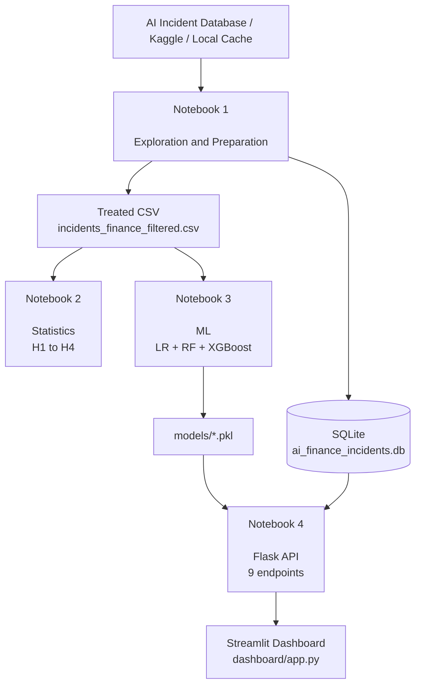

<!--START  🇬🇧English LANGUAGE BUTTON  -->
##### \[[🇧🇷 Português](README.pt_BR.md)\] \[**[🇬🇧 English](README.md)**\]   
<!--END 🇬🇧English LANGUAGE BUTTON  --  -->


<br><br>


<!-- ========= START REPO TITLE ========= -->
# <p align="center">  🔐 [AI Incidents in Banking, Financial Services and Fintech]()

<p align="center">
Modular AI Risk Intelligence Infrastructure for Financial Incident Analytics, Governance, Compliance, and Regulatory Decision-Making
</p>

<p align="center">
AI-powered ecosystem for semantic analytics, operational risk intelligence, interactive dashboards, APIs, and LLM-driven insights.
</p>


<br><br>


<!-- ========= START TEASER ========= -->
###### <p align="center"> **Where intelligent systems monitor financial risk...** </p>

###### <p align="center"> ***While humans monitor the intelligent systems***. <br>

###### <p align="center"> ⚡

<br>

#

<br><br>
<!-- ========= END TEASER ========= -->


 <!-- START ♡ Sponsor BADGE ····· 🇶 Quantum Software Development -->
<p align="center">
  <a href="https://github.com/sponsors/Quantum-Software-Development">
    
    
  </a>
</p>

  
<br><br>
 <!--END♡ Sponsor BADGE ····· 🇶 Quantum Software Development -->

 
 
 <!-- ========= START PUC GIF ========= -->
<p align="center">
   
 </p>

 <br>
<!-- ========= END PUC GIF ========= -->


<!-- ========= START 🇧🇷 Top CommtributorsE ========= -->
<p align="center">
  <a href="https://user-badge.committers.top/brazil/FabianaCampanari">
    
    
  </a>
</p>

</p>

<br><br><br>
<!-- ========= END 🇧🇷 Top CommtributorsE  ========= -->

<!-- ========= START Institutional INFO ========= -->
Institution:** Pontifical Catholic University of São Paulo (PUC-SP) — FACEI  
[**Bachelor’s Program:**]() Humanistic AI & Data Science • 5th Semester • 2026  
[**Course:**]() AI Security, Cybersecurity & Social Engineering  
**Professors** [✨ Carlos Eduardo Paes](https://www.linkedin.com/in/carlos-eduardo-de-barros-paes-ph-d-7b137a4/)  and  [✨ Eduardo Savino Gomes]() 
**Author:** [Fabiana ⚡️ Campanari](https://linktr.ee/fabianacampanari) 

<br>

#

<br><br><br>
<!-- ========= END Institutional INFO ========= -->


<!-- ========= START Dashboard Streamlit ========= -->
<p align="center">
  <a href="https://ai-incidents-financial-services.streamlit.app/" target="_blank" rel="noopener noreferrer">
    
  </a>
</p>
<!-- ========= END Dashboard Streamlit ========= -->

<!-- ========= START REACT APP ========= -->
<p align="center">

  <a href="https://resilient-sorbet-9836d4.netlify.app/" target="_blank" rel="noopener noreferrer">
    
  </a>
  <!-- ========= END REACT APP ========= -->

<!-- ========= START PPTX ========= -->
  <a href="https://docs.google.com/presentation/d/1nVb2i7pirzJpoeF4YCc4BVRMSXNYWmgs/edit?slide=id.p1#slide=id.p1" target="_blank" rel="noopener noreferrer">
    
  </a>

</p>
<!-- ========= END PPTX ========= -->

<!-- ========= START DATA ANALYSING REPORT ========= -->
<p align="center">
  <a href="https://github.com/Quantum-Software-Development/4-cybersecurity-social-engineering-project-ai-risk-intelligence-financial-incidents-analytics/blob/5f4ae57543d61147d765d707852d85f616c09f1b/Data%20Analysing%20Report/%F0%9F%87%AC%F0%9F%87%A7data_analysis_report_abnt%20.pdf">
    
  </a>
</p>

<br><br>

#

<br><br>
<!-- ========= END Data Analysis Report BADGE ========= -->


<!-- ========= START DEMO VIDEO ========= -->
https://github.com/user-attachments/assets/5d3c33b0-166e-414c-a561-8e8dd509be3d

######  Creative Direction, Music Curation & Editing by Fab⚡️  
###### 🎶 [Soundtrack:]() "Canon in D" — Johann Pachelbel

<br><br><br>
<!-- ========= END DEMO VIDEO ========= -->


<!-- ========= START BADGES GROUP 2 ========= -->
<p align="center">
  
  
  
</p>

<p align="center">
  
  
  
  
</p>

<p align="center">
  
  
  
  
  
</p>

<br><br><br>
<!-- ========= END BADGES GROUP 2 ========= -->


<!-- ========= START NOTE ========= -->
> [!WARNING]
>
> ⚠️ Projects may be publicly shared when permitted.  
> The focus is on applied, hands-on learning with real datasets in AI governance and security contexts.  
> All sensitive content remains protected in private repositories when required.
>

<br><br>
<!-- ========= END NOTE ========= -->

<!-- ========= START OVERVIEW ========= -->
##  [Overview]()

This project consolidates an end-to-end perspective on AI incidents in financial services, connecting public data from the AI Incident Database (AIID) to a complete pipeline of analysis, modeling, and exposure via API and dashboard.

From an executive perspective, the work demonstrates how dispersed incidents can be transformed into structured risk indicators, with a focus on [**algorithmic bias**](), [**operational risk**](), and [**governance responses**](). The main contribution lies in the **integrated analytical architecture**: from data acquisition to the availability of RESTful endpoints and a visualization layer.

<br>

➠ [***The system answers questions such as:***]()

[-]() Which types of AI applications generate the most incidents in the financial sector (credit, fraud detection, customer service, algorithmic trading, etc.)? <br>  

[-]() Does algorithmic bias affect customer segments unevenly (income level, region, gender, vulnerable groups)? <br>

[-]() Is it possible to predict incident severity before a regulatory investigation, based on case attributes and model usage context? <br>  

[-]() Which categories of operational risk are most associated with AI incidents in banks, insurers, and fintechs (fraud, process failures, IT issues, outsourcing)? <br>  

[-]() How do incident frequency and types evolve over time, and do they concentrate in specific institutions or regulatory jurisdictions? <br>  

[-]() What governance patterns appear in incident responses (model suspension, policy review, regulator notification, fines)? <br>  

[-]() Are there early warning indicators in incident data that correlate with higher exposure to operational losses or reputational risk? <br>

[-]() To what extent do incidents involving generative AI differ from those involving traditional machine learning models in the financial context? <br>

[-]() How can AI risk metrics be integrated into existing frameworks for operational risk management, cybersecurity, and compliance in the financial sector? <br>

[-]() What transparency and incident reporting gaps still exist, and how can structured monitoring support regulators and risk teams?

<br>

> [!IMPORTANT]
>
> [**Correct positioning**:]() predictive models should be treated as a **methodological proof of concept**. The main deliverable is the integrated analytical architecture — not a high-accuracy classifier ready for production.
> <br>

<br><br>

#

<br><br>
<!-- ========= END Overview ========= -->

<!-- ========= START Main Repo REFERENCE  ========= -->
> [!TIP]
>
> ## 🔐 Cybersecurity, Social Engineering & AI Security —  Hub
>
> This repository is part of a broader academic and technical ecosystem dedicated to Cybersecurity, Social Engineering, Artificial Intelligence Security, Financial Risk Intelligence, and Human-Centered Technology.
>
> The project explores AI incident analysis, operational risk monitoring, governance frameworks, compliance intelligence, semantic analytics, and regulatory-oriented AI infrastructures for banking, financial services, and fintech environments.
>
> Explore the central repository containing complementary materials, technical documentation, analyses, and related projects:
>
> 🔗 **[Cybersecurity, Social Engineering & AI Security —  Hub Repository](https://github.com/Quantum-Software-Development/1-Cybersecurity-SocialEngineering_Hub)**
>
> #
>
> ✨ Part of the **Human-Centered AI & Data Science Modeling Series**
>
> *Integrating cybersecurity, artificial intelligence, financial risk analytics, data science, and human perspective through applied research and intelligent systems.*


<br><br><br><br>
<!-- ========= END Main Repo REFERENCE  ========= -->
<!-- ======================================= END DEFAULT HEADER ⚡️ ===========================================  -->

## Table of Contents

1. [Introduction](#1-introduction)
2. [Objectives and Research Questions](#2-objectives-and-research-questions)
3. [Theoretical Foundation and Data Context](#3-theoretical-foundation-and-data-context)
4. [CRISP-DM Methodology](#4-crisp-dm-methodology)
5. [Data Sources and Preparation](#5-data-sources-and-preparation)
6. [Analytical Variables and Hypotheses](#6-analytical-variables-and-hypotheses)
7. [Statistical Analysis and Inferential Results](#7-statistical-analysis-and-inferential-results)
8. [Machine Learning Modeling](#8-machine-learning-modeling)
9. [Relational Database and RESTful API](#9-relational-database-and-restful-api)
10. [Interactive Dashboard](#10-interactive-dashboard)
11. [System Architecture](#11-system-architecture)
12. [Technical Notebook Structure](#12-technical-notebook-structure)
13. [Consolidated Results](#13-consolidated-results)
14. [Limitations and Methodological Considerations](#14-limitations-and-methodological-considerations)
15. [Technology Stack](#15-technology-stack)
16. [Local Execution Guide](#16-local-execution-guide)
17. [Groq API Configuration](#17-groq-api-configuration)
18. [Production Deployment](#18-production-deployment)
19. [Infrastructure and API Deployment on Render](#19-infrastructure-and-api-deployment-on-render)
20. [Project Structure](#20-project-structure)
21. [Dependencies](#21-dependencies)
22. [General Data Analysis and Machine Learning Modeling](#22-general-data-analysis-and-machine-learning-modeling)
23. [Conclusions and Future Work](#23-conclusions-and-future-work)
24. [Acknowledgements](#24-acknowledgements)
25. [References](#25-references)

<br><br>


## 1. [Introduction]()

<br>

### 1.1 [**Context of the topic**]()

The use of Artificial Intelligence systems in the financial sector has been growing rapidly in applications such as [**credit scoring**](), [**fraud detection**](), [**algorithmic trading**](), *[**risk assessment**](), customer service automation, and compliance support. This advancement expands institutions’ operational capacity but also introduces new risk vectors, especially in highly regulated environments sensitive to automated decision-making failures.

In the financial sector, AI failures do not only affect technical performance. They can generate reputational damage, discriminatory bias, operational losses, regulatory scrutiny, and changes in internal policies. Therefore, analyzing real AI incidents in this domain is a concrete way to bridge algorithmic governance, risk management, and empirical evidence.

This project was built using real documented incidents from the [**AI Incident Database (AIID)**](https://incidentdatabase.ai/) filtered for the financial services context. The central proposal is to transform this dataset into a structured analytical base capable of supporting statistical analysis, predictive modeling, relational storage, API exposure, and dashboard consumption.

<br>

### 1.2 [**Research problem**]()

Given a set of AI incidents recorded across multiple sectors and filtered to the financial domain, the central problem is to evaluate whether:

<br>

[-]() there are **systematic patterns** of bias and risk associated with certain types of AI applications (credit, fraud, *trading*);
[-]() certain **customer segments** are disproportionately affected;
[-]() **governance and regulatory responses** adequately match the severity of incidents.

<br>

### 1.3 [**Relevance to the financial sector and AI governance**]()

<br>

| [Stakeholder]()            | [Direct Benefit]()                                           |
| -------------------------- | ------------------------------------------------------------ |
| [**Banks and Fintechs**]() | Improve operational and reputational risk management         |
| [**Regulators**]()         | Evidence-based and data-driven supervision                   |
| [**Risk Managers**]()      | Tools to assess exposure to AI incidents                     |
| [**Compliance**]()         | Identify regulatory gaps and prioritize audits               |
| [**Investors**]()          | Understand the impact of AI incidents on institutional value |

<br>

> [!TIP]
>
> For [**AI governance**](), the project illustrates how incident data can be transformed into indicators, predictive models, and APIs, enabling continuous monitoring and structured responses to risks.
>

<br><br>

## 2. [Objectives and Research Questions]()

<br>

### 2.1 [General Objective]()

To evaluate, based on structured data from AI incidents in the financial sector, whether there are relevant patterns of **algorithmic bias**, **operational risk**, and **governance**, producing evidence useful for analysis, monitoring, and decision support.

<br>

### 2.2 [Specific objectives]()

<br>

[1.]() Identify AI incidents related to financial services. <br>
[2.]() Structure and enrich the data with derived analytical variables. <br>
[3.]() Evaluate statistical hypotheses on concentration, bias, severity, and regulatory response.   <br>
[4.]() Build predictive models for severity classification and regulatory investigation. <br>
[5.]() Organize results into an architecture composed of notebooks, relational database, RESTful API, and dashboard.

<br>

### 2.3 [Research hypotheses]()

<br>

| [Hypothesis]() | [Question]()                                                   | [Approach]()                        |
| -------------- | -------------------------------------------------------------- | ----------------------------------- |
| [H1]()         | Are incidents concentrated in certain application types?       | Chi-square goodness-of-fit          |
| [H2]()         | Does algorithmic bias disproportionately affect segments?      | Chi-square test of independence     |
| [H3]()         | Do more severe incidents generate greater regulatory response? | Chi-square and logistic regression  |
| [H4]()         | Is there a temporal trend in incident volume?                  | Time correlation and trend analysis |

### ➠ [**Adopted significance level**](): α = 0.05 in all tests.

<br><br>

## 3. [Theoretical Foundation and Data Context]()

<br>

### 3.1 [AI Incident Database (AIID)]()

The project uses the **AI Incident Database (AIID)** as its main data source, a repository of real incidents involving AI systems, documented from public sources — maintained by the *Responsible AI Collaborative* and licensed under **CC BY-SA 4.0**.

<br>

| [Access mode]()     | [Address]()                                             | [Usage]()                                 |
| ------------------- | ------------------------------------------------------- | ----------------------------------------- |
| [Official portal]() | `https://incidentdatabase.ai/`                          | Navigation and context                    |
| [GraphQL API]()     | `https://incidentdatabase.ai/api/graphql`               | Programmatic data collection (Notebook 1) |
| [Kaggle dataset]()  | `kaggle datasets download konradb/ai-incident-database` | Offline fallback                          |

<br>

> [!IMPORTANT]
>
> Notebook 1 implements a **4-layer fallback strategy**: GraphQL API → JSON cache → CSV cache → local `incidents.csv`. This ensures reproducibility even without internet access.

<br><br>

### 3.2 [Thematic Scope: Financial Services]()

The project applies thematic filtering using more than 30 keywords across the `title` and `description` fields, targeting incidents related to:

<br>

[-]() credit, loans, mortgages, and credit scoring; <br>
[-]() fraud, AML, and money laundering; <br>
[-]() banks, fintechs, and payments; <br>
[-]() algorithmic trading and financial markets; <br>
[-]() insurance and automated underwriting; <br>
[-]() risk and asset management; <br>
[-]() robo-advisors.

<br>

### 3.3 [Source Limitations]()

| [Limitation]()                            | [Impact]()                        | [Adopted strategy]()          |
| ----------------------------------------- | --------------------------------- | ----------------------------- |
| [Only publicly reported incidents]()      | Underrepresentation of true total | Treat as a biased sample      |
| [Geographic bias (US and EU dominance)]() | Limited generalizability          | Restrict conclusions to scope |
| [Financial values rarely complete]()      | Severity proxy via text only      | Use keywords as indicators    |
| [Heterogeneous text quality]()            | Noisy derived variables           | Conservative heuristics       |

<br>

> [!IMPORTANT]
>
> These limitations do not invalidate the project, but require careful interpretation and moderation in conclusions.

<br>

### 3.4 [Paradigmatic Example: The 2010 Flash Crash]()

The [**Flash Crash of May 6, 2010**]() is one of the most emblematic examples of operational risk and market risk associated with automation in financial environments. At 2:32 PM New York time, the U.S. stock market experienced a sudden drop that, in approximately 36 minutes, temporarily erased more than US$ 1 trillion in market value.

During this interval, the [**Dow Jones Industrial Average**]() fell by more than 1,000 points, and some stocks briefly traded at extreme levels — in certain cases dropping from tens of dollars to just one cent — before rapidly returning to near-normal levels. The event demonstrated how highly automated markets can amplify disturbances at a systemic scale.

Regulatory analyses of the case indicate that one of the main triggers was the automated execution of a large sell order involving [**75,000 E-mini S&P 500 contracts**]() (electronic futures contracts that allow trading the S&P 500 index — an indicator of the 500 largest U.S. companies — with leverage), estimated at around US$ 4.1 billion. The algorithm executed orders based on a fraction of the trading volume in the previous minute, without incorporating sufficient [**guardrails**]() (protective mechanisms such as price, time, or volatility limits).

This configuration contributed to a chain reaction among [**high-frequency trading algorithms**]() ([*High-Frequency Trading*]() — HFT: automated systems that execute thousands of trades per second), which began trading contracts among themselves, amplifying volatility and temporarily degrading liquidity. As a consequence, containment mechanisms such as [**circuit breakers**]() (automatic trading halts triggered during extreme volatility) were activated to interrupt trading and stabilize the market.

<br>

### ➠ [**Impacts and institutional responses:**]()

<br>

* [**Regulatory investigation**](): the SEC ([*Securities and Exchange Commission*]() — U.S. securities regulator) and the CFTC ([*Commodity Futures Trading Commission*]() — U.S. derivatives regulator) conducted a joint formal investigation
* [**Policy changes**](): mandatory review of algorithmic trading systems and risk controls
* [**Strengthening of circuit breakers**](): implementation of more robust automatic interruption mechanisms
* [**Legal actions**](): prosecution against the trader responsible for the initial order

<br>

### ➠ [**Relevance to this project:**]()

<br>

Within the analytical framework developed, the Flash Crash exemplifies the derived variables implemented:

* [**`application_type: algorithmic_trading`**]() — automated trading algorithms
* [**`incident_type: market_disruption`**]() — systemic market disturbance
* [**`severity_level: critical`**]() — systemic, multi-billion-dollar short-term impact
* [**`regulatory_investigation: 1`**]() — formal SEC and CFTC investigation
* [**`policy_change: 1`**]() — mandatory review of trading systems

<br>

> [!IMPORTANT]
>
> This incident demonstrates how [**automated decision systems can generate billion-dollar operational losses within minutes, trigger severe regulatory investigations, and lead to mandatory institutional control revisions**]() — validating the need for robust analytical architectures for monitoring, governance, and algorithmic risk management in critical financial environments.

<br><br>


## 4. [CRISP-DM Methodology]()


The project was structured according to the [**CRISP-DM**]() (*Cross-Industry Standard Process for Data Mining*) methodology, which organizes the analytical lifecycle into six iterative phases.

<br>

### 4.1 [Applied Stages]()

| [CRISP-DM Phase]() | [Implementation in the project]() | [Notebook]() |
|---|---|---|
| [**Business Understanding**]() | Definition of the problem, objectives, and hypotheses | <br> <br> (README) |
| [**Data Understanding**]() | Initial exploration, quality, and analytical potential | Notebook 1 |
| [**Data Preparation**]() | Filtering, cleaning, derived features, SQLite | Notebook 1 |
| [**Modeling**]() | Encoding, targets, training, and model evaluation | Notebook 3 |
| [**Evaluation**]() | H1–H4 tests, statistical interpretation | Notebook 2 |
| [**Deployment**]() | Flask RESTful API, Streamlit dashboard | Notebook 4 + dashboard/app.py |

<br>

### 4.2 [Pipeline Flow]()

<br>



<br>

> [**Rule of thumb**](): always run the notebooks in the order 1 → 2 → 3 → 4. Running out of order will cause file not found errors.

<br><br>

## 5. [Data Used and Preparation]()

### 5.1 [Analytical Base]()

The processed base used in the analyses contains [**31 incidents**]() from the financial sector, covering the period from [**2003 to 2023**](). This subset was treated as the main dataset for statistics and modeling.

<br>

### 5.2 [Main Variables Used]()

<br>

| Field | Origin | Use |
|---|---|---|
| `incident_id` | Original | Primary key |
| `title` | Original | Filter and features |
| `text` | Derived (title + description) | Base of all derived variables |
| `year` | Derived from `date` | Temporal analysis (H4) |
| `application_type` | Feature engineered | H1, ML |
| `incident_type` | Feature engineered | H2, ML |
| `customer_segment` | Feature engineered | H2, ML |
| `severity_level` | Feature engineered | H3, ML target |
| `regulatory_investigation` | Feature engineered | H3, ML target |
| `fine_imposed` | Feature engineered | ML feature |
| `policy_change` | Feature engineered | ML feature |
| `third_party_audit` | Feature engineered | ML feature |

<br>

### 5.3 [Preparation Pipeline (Notebook 1)]()

1. Standardization of column names to `snake_case`
2. Conversion of dates → `datetime` + extraction of `year`
3. Creation of the `text` field = `title + " " + description` (lowercase)
4. Removal of duplicates by `incident_id`
5. Thematic filtering by financial keywords
6. Feature engineering <br> <br> 8 derived variables
7. Saving the `incidents_finance_filtered.csv`
8. Creation and population of the SQLite database (3 tables)

<br>

### 5.4 [Justification for Using the Treated CSV]()

Although the official AIID API is useful for acquisition and updates, the analytical stage depends heavily on the semantic quality of the textual fields. The project adopts the [**treated and enriched CSV**]() as the main source for the subsequent stages, offering greater consistency and reproducibility.


<br><br>

## 6. [Analytical Variables and Hypotheses]()

<br>

### 6.1 [The 8 Derived Variables]()


The variables were constructed by [**heuristic inference on free text**](), using the consolidated `text` field. This approach is deterministic, explicit, and reproducible < although it depends on the semantic density of the textual fields.

<br>

| Variable | Type | Analytical Purpose |
|---|---|---|
| `application_type` | Categorical (7 classes) | Type of financial AI application |
| `incident_type` | Categorical (6 classes) | Nature of the incident |
| `customer_segment` | Categorical (5 classes) | Affected customer group |
| `severity_level` | Ordinal (4 levels) | Severity of the incident |
| `regulatory_investigation` | Binary | Formal regulatory investigation |
| `fine_imposed` | Binary | Fine or sanction applied |
| `policy_change` | Binary | Policy or system change |
| `third_party_audit` | Binary | Independent audit conducted |

<br>

### 6.2 [Semantic Matching by Keywords]()

The [**"semantic correlation"**]() in the project was implemented as a match by keywords and textual radicals <br> <br> not with embeddings, TF-IDF, or advanced NLP. Each incident receives the class of the [**first**]() compatible set found in the `text`, with fallback categories when there is not enough evidence.

<br>

[**`application_type`**]() <br> <br> keyword examples:
- `credit_scoring`: credit scor, loan, lending, mortgage
- `fraud_detection`: fraud, aml, anti-money laundering
- `algorithmic_trading`: trading, high-frequency, flash crash
- `risk_assessment`: underwriting, insurance, risk assessment

<br>

[**`incident_type`**]() <br> <br> keyword examples:
- `algorithmic_bias`: bias, discriminat, racial, unfair, disparate impact
- `operational_failure`: crash, failure, outage, bug, error
- `market_disruption`: flash crash, volatility, circuit breaker
- `data_breach`: breach, leak, hack, privacy violation

  <br>

[**`severity_level`**]() <br> <br> gradual impact logic:
- `critical`: bankrupt, systemic, shutdown, billion, flash crash, tens of thousands
- `high`: investigation, lawsuit, fine, penalty, significant loss, deepfake
- `medium`: complaint, concern, review, criticized, alleged
- `low`: absence of the signs above

<br>

[**Governance Flags**]() <br> <br> specific keywords:
- `regulatory_investigation`: investigation, inquiry, probe, sec, regulator
- `fine_imposed`: fine, penalty, sanction, settlement
- `policy_change`: policy change, suspended, discontinued, halted
- `third_party_audit`: audit, independent review, third-party

<br>

### 6.3 [Methodological Limitations of Derived Variables]()

This inference is an [**interpretable and reproducible heuristic**](), not deep semantic understanding. When `title` or `description` are poor or incomplete, the quality of derived variables weakens. Among the recommended next steps is to evolve to embeddings (FinBERT) and TF-IDF at the corpus scale.

<br><br>


## 7. [Statistical Analysis and Inferential Results]()

[**Notebook 2**]() implements the [**Evaluation**]() phase with descriptive statistics, bivariate analysis, and hypothesis testing on the 31 incidents from the 2003–2023 period.

<br>

### 7.1 [H1 - Concentration by Application Type]()

- [**Test**](): Chi-square goodness of fit (uniform distribution as H₀)
- [**Managerial interpretation**](): Rejection of uniformity identifies where governance must be more intensive (credit, fraud, algorithmic trading)

<br>

### 7.2 [H2 - Algorithmic Bias by Customer Segment]()

- [**Test**](): Chi-square test of independence
- [**Relevance**](): Connects AI ethics with operational and reputational risk; unequally affected segments can generate regulatory scrutiny and lawsuits

<br>

### 7.3 [H3 -  Severity and Regulatory Response]()

- [**Tests**](): Chi-square test of association + Logistic Regression (Odds Ratio)
- [**Complement**](): The logistic regression studies the relationship between incident attributes and the probability of regulatory investigation

<br>

### 7.4 [H4 -Temporal Trend]()

- [**Tests**](): Spearman Correlation + Linear Regression (OLS)
- [**Caution**](): With a small base and short series, robust temporal patterns require more data

<br>

###  7.5 [Critical Reading of the Results]()

The most valuable contribution of Notebook 2 is not in "proving" hypotheses, but in organizing the analytical reasoning in a rigorous way. Even with limited statistical power, the notebook provides a coherent evaluation structure for the distribution of incidents, asymmetry between segments, the severity-governance relationship, and temporal evolution <br> <br> supporting the [**empirical evidence layer**]() of the project.


<br><br>


## 8. [Machine Learning Modeling]()

[**Notebook 3**]() implements the [**Modeling**]() phase, developing supervised models for two tasks.

<br>

### 8.1 [ Modeling Dataset]()

| Attribute | Value |
|---|---|
| Total incidents | 31 |
| Initial features | 19 |
| Features after encoding | 14 |
| Missing values | None |

<br>

### 8.2 [Targets and Imbalance]()

#### ➠ [**Model 1 <br> <br> Binary Severity**]() (`severity_binary`):
- Class 0 (low/medium): 28 cases <br> <br> [**90.3%**]()
- Class 1 (high/critical): 3 cases <br> <br> [**9.7%**]()
- Imbalance ratio: [**9.33**]()

  <br>

#### ➠ [**Model 2 <br> <br> Regulatory Investigation**]() (`regulatory_investigation`):
- Class 0 (no investigation): 30 cases <br> <br> [**96.8%**]()
- Class 1 (with investigation): 1 case <br> <br> [**3.2%**]()

<br>

> This distribution is the [**central methodological problem**]() of the project.

<br>

### 8.3 [Implemented Algorithms]()

| Algorithm | Role |
|---|---|
| [**Logistic Regression**]() | Interpretable linear baseline |
| [**Random Forest**]() | Tree ensemble, robust to noise |
| [**XGBoost**]() | High-performance gradient boosting |

<br>


### 8.4 [Reported Results]()

| Model | Algorithm | F1-Score | ROC-AUC |
|---|---|---|---|
| Severity | XGBoost | [**0.0000**]() | 0.0833 |
| Investigation | XGBoost | [**0.0000**]() | NaN |

<br>

### 8.5 [Correct Technical Interpretation]()

These results show that the modeling, in its current form, [**has not achieved reliable predictive performance**](). The correct reading is:

- the ML pipeline was implemented correctly;
- feature engineering and serialization of the artifacts were performed;
- the base is too small and heavily imbalanced for robust generalization;
- the models should be treated as a [**proof of concept**](), not as a mature predictive solution.

<br>

### 8.6 [Value of the Notebook despite low performance]()

Notebook 3 has academic value because it demonstrates: data preparation for ML, encoding, defining targets, comparing algorithms, evaluating with metrics, and serializing for integration with the API <br> <br> fulfilling the [**Modeling**]() phase of CRISP-DM in a didactic and traceable manner.

<br><br>

## 9. [Relational Database and RESTful API]()

[**Notebook 4**]() implements the [**Deployment**]() phase, creating a Flask API to expose data and models.

<br>


### 9.1 [Relational Schema (SQLite)]()

<br>


```sql
-- 3 related tables (minimum briefing requirement)
CREATE TABLE incidents (
    incident_id INTEGER PRIMARY KEY,
    title TEXT, summary TEXT,
    occurred_date DATE, year INTEGER,
    application_type TEXT, customer_segment TEXT,
    incident_type TEXT, severity_level TEXT, text TEXT
);
CREATE TABLE financial_impacts (
    impact_id INTEGER PRIMARY KEY AUTOINCREMENT,
    incident_id INTEGER NOT NULL,
    severity_level TEXT, estimated_loss TEXT, impact_description TEXT,
    FOREIGN KEY (incident_id) REFERENCES incidents(incident_id)
);
CREATE TABLE regulatory_responses (
    response_id INTEGER PRIMARY KEY AUTOINCREMENT,
    incident_id INTEGER NOT NULL,
    regulatory_investigation INTEGER DEFAULT 0,
    fine_imposed INTEGER DEFAULT 0,
    policy_change INTEGER DEFAULT 0,
    third_party_audit INTEGER DEFAULT 0,
    FOREIGN KEY (incident_id) REFERENCES incidents(incident_id)
);
```

<br>


### 9.2 [API Endpoints (9 in total)]()


[**Base URL**](): `http://localhost:5000` (local) or Render URL (production)

<br>

| Group | Method | Route | Description |
|---|---|---|---|
| [**Documentation**]() | GET | `/` | Status and list of endpoints |
| [**Data**]() | GET | `/api/incidents` | List with filters (application_type, severity_level, year, limit) |
| [**Data**]() | GET | `/api/incidents/<id>` | Detail + financial impact + regulatory response |
| [**Statistics**]() | GET | `/api/stats/by-application` | Concentration by application type |
| [**Statistics**]() | GET | `/api/stats/by-segment` | Incidents and bias rate by segment |
| [**Statistics**]() | GET | `/api/stats/temporal` | Time series by year |
| [**Statistics**]() | GET | `/api/stats/governance` | Frequency of governance flags |
| [**Predictions**]() | POST | `/api/predict/severity` | Classifies as high/low severity |
| [**Predictions**]() | POST | `/api/predict/investigation` | Probability of regulatory investigation |

<br>


### 9.3 [Usage Example]()

<br>


```bash
# [List filtered incidents]()
curl "http://localhost:5000/api/incidents?application_type=credit_scoring&limit=10"

# [Severity prediction]()
curl -X POST http://localhost:5000/api/predict/severity \
  -H "Content-Type: application/json" \
  -d '{
    "application_type": "credit_scoring",
    "incident_type": "algorithmic_bias",
    "customer_segment": "retail",
    "year": 2024,
    "fine_imposed": 0,
    "policy_change": 0,
    "third_party_audit": 0
  }'

# [Expected response:]()
# [{"prediction": "high", "probability": 0.78, "confidence": "high",]()
# ["interpretation": "Severity: HIGH | confidence: high"}]()
```

<br>


### 9.4 [Train-Production Consistency (`prepare_model_input`)]()

The `prepare_model_input` function ensures three critical points:

1. [**Replicates the training transformation pipeline**](): applies `get_dummies` with the same categories
2. [**Creates missing columns with a value of 0**](): avoids `shape mismatch` errors
3. [**Orders columns in the same sequence as training**](): ensures correct alignment with the model's coefficients

<br>


### 9.5 [Critical Observation]()

The predictive endpoints are technically functional, but they depend on models with F1 = 0. They should be interpreted as a [**demonstration of integration**](), not as a reliable decision mechanism.


<br><br>

## 10. [Interactive Dashboard]()

<br>


### 10.1 [Overview]()

The dashboard (`dashboard/app.py`, built with Streamlit) is the visual consumption layer of the project. It consumes the Flask API via HTTP <br> <br> [**it does not read files directly**]() <br> <br> respecting the separation of concerns in the architecture.

<br>


```python
# [Automatic API URL resolution:]()
# [1. st.secrets["API_BASE_URL"] → Streamlit Cloud]()
# [2. os.environ["API_BASE_URL"] → Local .env]()
# [3. "http://localhost:5000"    → Standard fallback]()
```

<br>

When the API is offline, the dashboard loads the local CSV as an [**automatic fallback**]()  it never breaks during the demonstration.

<br>


### 10.2 [Implemented Pages]()

<br>


| Page | Content |
|---|---|
| [**📊 Overview**]() | 5 dynamic KPI cards · distribution by application · severity donut · time series · governance bars |
| [**🔍 Explorer**]() | Table filtered by application/severity/type/year · CSV download |
| [**📈 Statistical Analysis**]() | Complete H1–H4 with scipy calculations · result badges · correlation heatmap |
| [**🤖 ML Models**]() | Algorithm comparison · Feature Importance · ROC curves · confusion matrix |
| [**🔌 API Explorer**]() | Live status · endpoint selector · parameters · JSON response |
| [**🎯 Risk Predictor**]() | Form → prediction M1 (severity) + M2 (investigation) → probability gauges |
| [**💬 AI Assistant**]() | Groq llama-3.1-8b-instant + contextualized offline responses · history · suggestions |

<br>


### 10.3 [Chatbot: OpenAI → Groq Replacement]()

The chatbot was migrated from OpenAI to [**Groq (llama-3.1-8b-instant)**]():

<br>


| Criterion | OpenAI (before) | Groq (now) |
|---|---|---|
| [**Cost**]() | ~$0.15/1M tokens | [**Free**]() |
| [**Speed**]() | ~40 tok/s | [**~270 tok/s**]() |
| [**Required SDK**]() | `openai` | [**Only `requests`**]() |
| [**Configuration**]() | Manual via UI | [**Automatic**]() (secrets → env → UI) |
| [**Fallback**]() | Offline mode | Offline mode + automatic retry |

<br>


➠ [**Key resolution logic**]() (without changing code between environments):

<br>

```python
def _get_groq_key() -> str:
    try: return st.secrets["GROQ_API_KEY"]      # 1. Streamlit Cloud
    except: pass
    env = os.environ.get("GROQ_API_KEY", "")
    if env: return env                           # 2. Environment variable
    return st.session_state.get("groq_key_manual", "")  # 3. Manual input
```

### 10.4 [UI/UX Features]()

- [**Dark/Light mode**]() with toggle in the sidebar
- [**KPI cards**]() with values, icons, and deltas
- [**Plotly Charts**]() fully interactive
- [**CSV Download**]() filtered
- [**API Status**]() in real-time (badge in the sidebar)
- [**Automatic Fallback**]() <br> <br> works without API and without Groq key


<br><br>

## 11. [System Architecture - MLOps Design]()

```mermaid
%%{init: {'theme':'dark'}}%%
flowchart LR

subgraph L1["Source Layer"]
    A1["External AI Incident DB"]
    A2["Kaggle Dataset"]
end

subgraph L2["Data Preparation Layer"]
    B1["Notebook 1\nIngestion & Cleaning"]
    B2["Feature Engineering"]
    B3["Validated Analytical CSV"]
end

subgraph L3["Analytical & Modeling Layer"]
    C1["Notebook 2\nStatistical Analysis"]
    C2["Notebook 3\nML Training"]
    C3["Model Evaluation"]
end

subgraph L4["Storage & Governance Layer"]
    D1[("SQLite Analytical Store")]
    D2[("Model Registry")]
    D3["GitHub Repository\nVersion Control"]
end

subgraph L5["Deployment & Orchestration Layer"]
    E1["Render Deployment Pipeline"]
    E2["Streamlit Cloud Deployment"]
end

subgraph L6["Serving & Inference Layer"]
    F1["Flask REST API\nPrediction Endpoints"]
    F2["Public HTTPS Interface"]
    F3["Groq API\nllama-3.1-8b-instant"]
end

subgraph L7["Consumption & Experience Layer"]
    G1["Executive Dashboard"]
    G2["Risk Scoring Interface"]
    G3["AI Assistant for Analysis"]
end

subgraph L8["Stakeholder Layer"]
    H1["Researchers & Academics"]
    H2["Risk / Compliance Teams"]
    H3["Decision Makers & Reviewers"]
end

A1 --> B1
A2 --> B1
B1 --> B2
B2 --> B3
B3 --> C1
B3 --> C2
B3 --> D1
C2 --> C3
C3 --> D2
B1 --> D3
C1 --> D3
C2 --> D3
D1 --> F1
D2 --> F1
D3 --> E1
D3 --> E2
E1 --> F1
F1 --> F2
F2 --> G1
F2 --> G2
F2 --> G3
F3 --> G3
E2 --> G1
G1 --> H1
G1 --> H2
G2 --> H2
G3 --> H1
G3 --> H3

%% STYLE
classDef node fill:#0d1117,stroke:#00d1c1,stroke-width:1.6px,color:#ffffff;
classDef db fill:#0d1117,stroke:#00d1c1,stroke-width:2.4px,color:#ffffff;
classDef cloud fill:#0d1117,stroke:#00d1c1,stroke-width:1.9px,color:#ffffff;
classDef layer fill:#111827,stroke:#00d1c1,stroke-width:1.4px,color:#ffffff;

class A1,A2,B1,B2,B3,C1,C2,C3,F1,F2,F3,G1,G2,G3,H1,H2,H3 node;
class D1,D2 db;
class D3,E1,E2 cloud;
class L1,L2,L3,L4,L5,L6,L7,L8 layer;
```


<br>



<br>


➠  [Click here to view the diagram in higher resolution.](https://github.com/Quantum-Software-Development/4-cybersecurity-social-engineering-project-ai-risk-intelligence-financial-incidents-analytics/blob/99fe399886300a088411de18650726f4441bb71c/MLOps-Architecture%20.md)


<br>

### 11.2 [Components and Responsibilities]()

| Component | Current Technology | Recommended Evolution |
|---|---|---|
| Data Sources | AIID API, Kaggle CSV | Streaming with Kafka |
| Data Ingestion | pandas + requests | Airflow + dbt |
| Feature Store | Processed CSV | Feast / Tecton |
| Training Pipeline | Jupyter + scikit-learn | MLflow + Kubeflow |
| Model Registry | .pkl on disk | MLflow Registry |
| Data Warehouse | SQLite | PostgreSQL / BigQuery |
| Inference API | Flask | FastAPI + Gunicorn |
| Presentation Layer | Streamlit | Tableau / PowerBI |


<br>

### 11.3 [Complete Data Flow]()

```
Ingestion → Processing → Feature Engineering → Training → Serialization
    → Flask API (serving) → Streamlit Dashboard (consumption) → Groq (chatbot)
```

<br>

### 11.4 [File Architecture Decisions]()

> [**Why is `ai_finance_incidents.db` in the root?**]()
> The database is accessed by the API (`api/`) and the notebooks (`notebooks/`). Keeping it in the root with `os.path.abspath` eliminates ambiguity in any OS.


<br>

> [**Why `api/app_api.py` and not `app.py` in the root?**]()
> To eliminate conflict with `dashboard/app.py`. Both were called `app.py` <br> <br> distinct subfolder + name resolve this permanently.


<br><br>


## [12. Technical Structure of Notebooks]()


### [Notebook 1 - Exploration and Preparation]()

[**CRISP-DM Phase**](): Data Understanding + Data Preparation

[**Deliverables**]():

<br>


```
data/incidents_finance_filtered.csv   ← analytical base of all notebooks
ai_finance_incidents.db               ← database with 3 tables for the API
assets/distribuicao_variaveis.png     ← distributions dashboard
```

<br>

### [Notebook 2 - Statistical Analysis]()

[**CRISP-DM Phase**](): Evaluation

Produces results of the H1–H4 tests and analytical visualizations.

<br>

### [Notebook 3 <br> <br> ML Modeling]()

[**CRISP-DM Phase**](): Modeling

[**Deliverables**]():

<br>


```
models/severity_classifier.pkl        ← Serialized Model 1
models/investigation_classifier.pkl   ← Serialized Model 2
models/features_severity.pkl          ← Feature list for Model 1
models/features_investigation.pkl     ← Feature list for Model 2
```

<br>

### [Notebook 4 <br> <br> RESTful API and Deployment]()

[**CRISP-DM Phase**](): Deployment

[**Deliverable**]():

<br>

```
api/app_api.py    ← Flask API ready for independent execution
```

<br><br>


## [13. Consolidated Results]()

### [13.1 What the project delivers solidly]()

<br>

| Deliverable | Status |
|---|---|
| Thematic base of financial incidents | ✅ Solid |
| 8 derived variables with explicit logic | ✅ Solid |
| Formalized H1–H4 hypothesis tests | ✅ Solid |
| Complete and serialized ML pipeline | ✅ Solid (technical) |
| Relational SQLite database with 3 tables | ✅ Solid |
| RESTful API with 9 functional endpoints | ✅ Solid |
| Dashboard with 7 interactive pages | ✅ Solid |
| Groq chatbot with offline fallback | ✅ Solid |

<br>

### [13.2 What should be stated with caution]()

<br>

| Statement | Caution Needed |
|---|---|
| "The predictive models are ready for use" | ❌ F1 = 0 indicates insufficient base |
| "XGBoost outperformed the other algorithms" | ⚠️ With 31 samples, comparisons are unstable |
| "The results are generalizable" | ⚠️ Only for the observed AIID scope |
| "The API can be used in production" | ⚠️ Lacks authentication, logging, and versioning |

<br>

### [13.3 Interpretative Synthesis]()

The statistical analysis suggests a concentration of incidents in certain types of applications, signs of unequal exposure among customer segments in cases of algorithmic bias, and evidence of a misalignment between potential severity and formal governance response. In managerial terms, this reinforces that AI systems in financial services should be evaluated not only for technical performance but also for distributive impact, operational criticality, and institutional response capacity.


<br><br>


## [14. Limitations and Methodological Care]()

### [14.1 Data Limitations]()

- [**Reduced base**](): only 31 incidents in the modeled scope
- [**Strong imbalance**](): 90.3% in a single severity class
- [**Only publicized incidents**](): underrepresentation of the real total
- [**Geographic bias**](): US and EU dominate the base
- [**Textual dependency**](): variable quality between incidents impacts the features

<br>


### [14.2 Statistical Limitations]()

- Low statistical power for strong inferences in small scopes
- High sensitivity to a few extreme cases (e.g., Flash Crash distorts H4)
- Fragility of tests applied to subgroups with fewer than 5 observations


<br>

### [14.3 ML and Deployment Limitations]()

- Classes too rare to guarantee robust generalization
- High risk of overfitting with F1 = 0 in the final metrics
- Functional API without typical production controls:
  - no authentication (JWT or API key)
  - no structured logging
  - no endpoint versioning (`/v1/`)
  - no rate limiting
  - no robust payload validation


<br><br>

## [15. Technology Stack]()

### [Backend]()

<br>

| Library | Version | Use |
|---|---|---|
| `flask` | ≥ 2.3 | RESTful API |
| `flask-cors` | ≥ 4.0 | Cross-origin for the dashboard |
| `pandas` | ≥ 2.0 | Data manipulation |
| `numpy` | ≥ 1.24 | Numerical operations |
| `scipy` | ≥ 1.11 | Statistical tests (H1–H4) |
| `statsmodels` | ≥ 0.14 | Logistic regression, OLS |
| `scikit-learn` | ≥ 1.3 | Preprocessing and models |
| `xgboost` | ≥ 1.7 | Main model |
| `joblib` | ≥ 1.3 | Model serialization |


<br>

### [Frontend]()

| Library | Version | Use |
|---|---|---|
| `streamlit` | ≥ 1.32 | Interactive dashboard |
| `plotly` | ≥ 5.18 | Interactive charts |
| `requests` | ≥ 2.31 | Calls to Flask and Groq API |

<br>

### [AI and Chatbot]()

| Provider | Model | Cost | Integration |
|---|---|---|---|
| [**Groq**]() *(main)* | llama-3.1-8b-instant | [**Free**]() | REST via `requests` |
| [**Offline mode**]() *(fallback)* | keywords | Zero | Local |


<br><br>


## [16. Local Execution Guide]()


<br><br>
<br><br>
<br><br>
<br><br>
<br><br>
<br><br>


<!-- ======================================= Start DEFAULT Footer ===========================================  -->
<br><br>


## 💌 [Let the data flow... Ping Me !](mailto:fabicampanari@proton.me)

<br>


#### <p align="center">  🛸๋ My Contacts [Hub](https://linktr.ee/fabianacampanari)


<br>

### <p align="center"> 


<br><br>

<p align="center">  ────────────── ⊹🔭๋ ──────────────

<!--
<p align="center">  ────────────── 🛸๋*ੈ✩* 🔭*ੈ₊ ──────────────
-->

<br>

<p align="center"> ➣➢➤ <a href="#top">Back to Top </a>
  

  
#
 
##### <p align="center"> Copyright 2026 Quantum Software Development. Code released under the  [MIT license.](https://github.com/Mindful-AI-Assistants/CDIA-Entrepreneurship-Soft-Skills-PUC-SP/blob/21961c2693169d461c6e05900e3d25e28a292297/LICENSE)


