```mermaid
%%{init: {'theme':'dark'}}%%
flowchart LR

subgraph L1["Source Layer"]
    A1["External AI Incident DB"]
    A2["Kaggle Dataset"]
end

subgraph L2["Data Preparation Layer"]
    B1["Notebook 1\nIngestion & Cleaning"]
    B2["Feature Engineering"]
    B3["Validated Analytical CSV"]
end

subgraph L3["Analytical & Modeling Layer"]
    C1["Notebook 2\nStatistical Analysis"]
    C2["Notebook 3\nML Training"]
    C3["Model Evaluation"]
end

subgraph L4["Storage & Governance Layer"]
    D1[("SQLite Analytical Store")]
    D2[("Model Registry")]
    D3["GitHub Repository\nVersion Control"]
end

subgraph L5["Deployment & Orchestration Layer"]
    E1["Render Deployment Pipeline"]
    E2["Streamlit Cloud Deployment"]
end

subgraph L6["Serving & Inference Layer"]
    F1["Flask REST API\nPrediction Endpoints"]
    F2["Public HTTPS Interface"]
    F3["Groq API\nllama-3.1-8b-instant"]
end

subgraph L7["Consumption & Experience Layer"]
    G1["Executive Dashboard"]
    G2["Risk Scoring Interface"]
    G3["AI Assistant for Analysis"]
end

subgraph L8["Stakeholder Layer"]
    H1["Researchers & Academics"]
    H2["Risk / Compliance Teams"]
    H3["Decision Makers & Reviewers"]
end

A1 --> B1
A2 --> B1
B1 --> B2
B2 --> B3
B3 --> C1
B3 --> C2
B3 --> D1
C2 --> C3
C3 --> D2
B1 --> D3
C1 --> D3
C2 --> D3
D1 --> F1
D2 --> F1
D3 --> E1
D3 --> E2
E1 --> F1
F1 --> F2
F2 --> G1
F2 --> G2
F2 --> G3
F3 --> G3
E2 --> G1
G1 --> H1
G1 --> H2
G2 --> H2
G3 --> H1
G3 --> H3

%% STYLE
classDef node fill:#0d1117,stroke:#00d1c1,stroke-width:1.6px,color:#ffffff;
classDef db fill:#0d1117,stroke:#00d1c1,stroke-width:2.4px,color:#ffffff;
classDef cloud fill:#0d1117,stroke:#00d1c1,stroke-width:1.9px,color:#ffffff;
classDef layer fill:#111827,stroke:#00d1c1,stroke-width:1.4px,color:#ffffff;

class A1,A2,B1,B2,B3,C1,C2,C3,F1,F2,F3,G1,G2,G3,H1,H2,H3 node;
class D1,D2 db;
class D3,E1,E2 cloud;
class L1,L2,L3,L4,L5,L6,L7,L8 layer;
```

<!-- ======================================= ⚡️ Start DEFAULT HEADER ===========================================  -->

<!-- ========= START LANGUAGE BUTTON ========= -->
 

**\[[🇧🇷 Português](README.pt_BR.md)\] \[**[🇬🇧 English](README.md)**\]**

  
<!-- ========= END LANGUAGE BUTTON ========= -->

<!-- ========= START REPO TITLE ========= -->
# 🔐 [AI Incidents in Banking, Financial Services and Fintech]()

Modular AI Risk Intelligence Infrastructure for Financial Incident Analytics, Governance, Compliance, and Regulatory Decision-Making

AI-powered ecosystem for semantic analytics, operational risk intelligence, interactive dashboards, APIs, and LLM-driven insights.

  
<!-- ========= END REPO TITLE ========= -->

<!-- ========= START Dashboard Streamlit ========= -->

  

<!-- ========= END Dashboard Streamlit ========= -->

  

  

<!-- ========= START DATA ANALYSING REPORT ========= -->

  

<!-- ========= END DATA ANALYSING REPORT ========= -->

   
<!-- ===================== END BADGE GROUP 1 ===================== -->

<!-- ========= START Institutional INFO ========= -->
[**Institution:**]() Pontifical Catholic University of São Paulo (PUC-SP – Humanistic AI & Data Science • 5th Semester • 2026)  
[**School:**]() FACEI – Faculty of Interdisciplinary Studies  
[**Course:**]() AI Security, Cybersecurity & Social Engineering  
**Professor:** [✨ Eduardo Savino Gomes]()  
**Authors:** [Fabiana ⚡️ Campanari](https://linktr.ee/fabianacampanari) and [Pedro Vyctor Almeida]()   
[**Context:**]() This project analyzes real-world Artificial Intelligence incidents in banks, financial services, and fintechs from the perspectives of AI security, cybersecurity, social engineering, governance, and regulatory compliance.

  

<!-- ========= START SPONSOR BADGES ========= -->
#### 
 

  
<!-- ========= END SPONSOR BADGES ========= -->

<!-- ========= START DEMO VIDEO ========= -->
https://github.com/user-attachments/assets/5d3c33b0-166e-414c-a561-8e8dd509be3d

#### 🖤 Creative Direction, Music Curation & Editing by Fab⚡️  
##### 🎶 [Soundtrack:]() "Canon in D" — Johann Pachelbel

   
<!-- ========= END DEMO VIDEO ========= -->

<!-- ========= START BADGES GROUP 2 ========= -->

  
  
  

  
  
  
  

  
  
  
  
  

   
<!-- ========= END BADGES GROUP 2 ========= -->

<!-- ========= START NOTE ========= -->
> [!NOTE]
>
> ⚠️ Projects may be publicly shared when permitted.  
> The focus is on applied, hands-on learning with real datasets in AI governance and security contexts.  
> All sensitive content remains protected in private repositories when required.
>

  
<!-- ========= END NOTE ========= -->

<!-- ========= START OVERVIEW ========= -->
##  [Overview]()

This project consolidates an end-to-end perspective on AI incidents in financial services, connecting public data from the AI Incident Database (AIID) to a complete pipeline of analysis, modeling, and exposure via API and dashboard.[web:1112]

From an executive perspective, the work demonstrates how dispersed incidents can be transformed into structured risk indicators, with a focus on [**algorithmic bias**](), [**operational risk**](), and [**governance responses**]().[web:1113][web:1126] The main contribution lies in the **integrated analytical architecture**: from data acquisition to the availability of RESTful endpoints and a visualization layer.[web:1112][web:1122]

 

[***The system answers questions such as:***]()

[-]() Which types of AI applications generate the most incidents in the financial sector (credit, fraud detection, customer service, algorithmic trading, etc.)?    

[-]() Does algorithmic bias affect customer segments unevenly (income level, region, gender, vulnerable groups)?  

[-]() Is it possible to predict incident severity before a regulatory investigation, based on case attributes and model usage context?    

[-]() Which categories of operational risk are most associated with AI incidents in banks, insurers, and fintechs (fraud, process failures, IT issues, outsourcing)?    

[-]() How do incident frequency and types evolve over time, and do they concentrate in specific institutions or regulatory jurisdictions?    

[-]() What governance patterns appear in incident responses (model suspension, policy review, regulator notification, fines)?    

[-]() Are there early warning indicators in incident data that correlate with higher exposure to operational losses or reputational risk?  

[-]() To what extent do incidents involving generative AI differ from those involving traditional machine learning models in the financial context?  

[-]() How can AI risk metrics be integrated into existing frameworks for operational risk management, cybersecurity, and compliance in the financial sector?  

[-]() What transparency and incident reporting gaps still exist, and how can structured monitoring support regulators and risk teams?

  

> [!IMPORTANT]
>
> [**Correct positioning**:]() predictive models should be treated as a **methodological proof of concept**. The main deliverable is the integrated analytical architecture — not a high-accuracy classifier ready for production.
>  

  

#

  
<!-- ========= END Overview ========= -->

<!-- ========= START Main Repo REFERENCE  ========= -->
> [!TIP]
>
> This repository is part of the flagship project:
> **🔐 Cybersecurity, Social Engineering & AI Security — Main Hub**
>
> Explore the complete ecosystem of materials, analyses, and notebooks in the central repository:
>
> * 🔗 **[Cybersecurity, Social Engineering & AI Security — Main Hub Repository](https://github.com/Quantum-Software-Development/1-Cybersecurity-SocialEngineering_Main_Hub_Repository-PUCSP)**
>
> *Part of the Humanistic AI Data Modeling Series — where data connects with human insight… and occasionally gets socially engineered. ⚡️

    
<!-- ========= END Main Repo REFERENCE  ========= -->
<!-- ======================================= END DEFAULT HEADER ⚡️ ===========================================  -->

## Table of Contents

1. [Introduction](#1-introduction)
2. [Objectives and Research Questions](#2-objectives-and-research-questions)
3. [Theoretical Foundation and Data Context](#3-theoretical-foundation-and-data-context)
4. [CRISP-DM Methodology](#4-crisp-dm-methodology)
5. [Data Sources and Preparation](#5-data-sources-and-preparation)
6. [Analytical Variables and Hypotheses](#6-analytical-variables-and-hypotheses)
7. [Statistical Analysis and Inferential Results](#7-statistical-analysis-and-inferential-results)
8. [Machine Learning Modeling](#8-machine-learning-modeling)
9. [Relational Database and RESTful API](#9-relational-database-and-restful-api)
10. [Interactive Dashboard](#10-interactive-dashboard)
11. [System Architecture](#11-system-architecture)
12. [Technical Notebook Structure](#12-technical-notebook-structure)
13. [Consolidated Results](#13-consolidated-results)
14. [Limitations and Methodological Considerations](#14-limitations-and-methodological-considerations)
15. [Technology Stack](#15-technology-stack)
16. [Local Execution Guide](#16-local-execution-guide)
17. [Groq API Configuration](#17-groq-api-configuration)
18. [Production Deployment](#18-production-deployment)
19. [Infrastructure and API Deployment on Render](#19-infrastructure-and-api-deployment-on-render)
20. [Project Structure](#20-project-structure)
21. [Dependencies](#21-dependencies)
22. [General Data Analysis and Machine Learning Modeling](#22-general-data-analysis-and-machine-learning-modeling)
23. [Conclusions and Future Work](#23-conclusions-and-future-work)
24. [Acknowledgements](#24-acknowledgements)
25. [References](#25-references)

  

## 1. [Introduction]()

 

### 1.1 [**Context of the topic**]()

The use of Artificial Intelligence systems in the financial sector has been growing rapidly in applications such as [**credit scoring**](), [**fraud detection**](), [**algorithmic trading**](), *[**risk assessment**](), customer service automation, and compliance support. This advancement expands institutions’ operational capacity but also introduces new risk vectors, especially in highly regulated environments sensitive to automated decision-making failures.

In the financial sector, AI failures do not only affect technical performance. They can generate reputational damage, discriminatory bias, operational losses, regulatory scrutiny, and changes in internal policies. Therefore, analyzing real AI incidents in this domain is a concrete way to bridge algorithmic governance, risk management, and empirical evidence.

This project was built using real documented incidents from the [**AI Incident Database (AIID)**](https://incidentdatabase.ai/) filtered for the financial services context. The central proposal is to transform this dataset into a structured analytical base capable of supporting statistical analysis, predictive modeling, relational storage, API exposure, and dashboard consumption.

 

### 1.2 [**Research problem**]()

Given a set of AI incidents recorded across multiple sectors and filtered to the financial domain, the central problem is to evaluate whether:

 

[-]() there are **systematic patterns** of bias and risk associated with certain types of AI applications (credit, fraud, *trading*);
[-]() certain **customer segments** are disproportionately affected;
[-]() **governance and regulatory responses** adequately match the severity of incidents.

 

### 1.3 [**Relevance to the financial sector and AI governance**]()

 

| [Stakeholder]()            | [Direct Benefit]()                                           |
| -------------------------- | ------------------------------------------------------------ |
| [**Banks and Fintechs**]() | Improve operational and reputational risk management         |
| [**Regulators**]()         | Evidence-based and data-driven supervision                   |
| [**Risk Managers**]()      | Tools to assess exposure to AI incidents                     |
| [**Compliance**]()         | Identify regulatory gaps and prioritize audits               |
| [**Investors**]()          | Understand the impact of AI incidents on institutional value |

  

> [!TIP]
>
> For [**AI governance**](), the project illustrates how incident data can be transformed into indicators, predictive models, and APIs, enabling continuous monitoring and structured responses to risks.
>

  

## 2. [Objectives and Research Questions]()

 

### 2.1 [General Objective]()

To evaluate, based on structured data from AI incidents in the financial sector, whether there are relevant patterns of **algorithmic bias**, **operational risk**, and **governance**, producing evidence useful for analysis, monitoring, and decision support.

  

### 2.2 [Specific objectives]()

 

[1.]() Identify AI incidents related to financial services.  
[2.]() Structure and enrich the data with derived analytical variables.  
[3.]() Evaluate statistical hypotheses on concentration, bias, severity, and regulatory response.    
[4.]() Build predictive models for severity classification and regulatory investigation.  
[5.]() Organize results into an architecture composed of notebooks, relational database, RESTful API, and dashboard.

 

### 2.3 [Research hypotheses]()

 

| [Hypothesis]() | [Question]()                                                   | [Approach]()                        |
| -------------- | -------------------------------------------------------------- | ----------------------------------- |
| [H1]()         | Are incidents concentrated in certain application types?       | Chi-square goodness-of-fit          |
| [H2]()         | Does algorithmic bias disproportionately affect segments?      | Chi-square test of independence     |
| [H3]()         | Do more severe incidents generate greater regulatory response? | Chi-square and logistic regression  |
| [H4]()         | Is there a temporal trend in incident volume?                  | Time correlation and trend analysis |

### ➠ [**Adopted significance level**](): α = 0.05 in all tests.

  

## 3. [Data Foundation and Context]()

 

### 3.1 [AI Incident Database (AIID)]()

The project uses the **AI Incident Database (AIID)** as its main data source, a repository of real incidents involving AI systems, documented from public sources — maintained by the *Responsible AI Collaborative* and licensed under **CC BY-SA 4.0**.

 

| [Access mode]()     | [Address]()                                          | [Usage]()                                     |
| --------------- | ------------------------------------------------------- | ----------------------------------------- |
| [Official portal]() | `https://incidentdatabase.ai/`                          | Navigation and context                    |
|[GraphQL API]()     | `https://incidentdatabase.ai/api/graphql`               | Programmatic data collection (Notebook 1) |
| [Kaggle dataset]()  | `kaggle datasets download konradb/ai-incident-database` | Offline fallback                          |

 

> [!IMPORTANT]
>
> Notebook 1 implements a **4-layer fallback strategy**: GraphQL API → JSON cache → CSV cache → local `incidents.csv`. This ensures reproducibility even without internet access.

 

  
  
  

## System Architecture (MLOps Design)

 

>  [Click here to view the diagram in higher resolution.](https://github.com/Quantum-Software-Development/4-cybersecurity-social-engineering-project-ai-risk-intelligence-financial-incidents-analytics/blob/99fe399886300a088411de18650726f4441bb71c/MLOps-Architecture%20.md)

  

  
  
  
  
  
  

<!-- ======================================= Start DEFAULT Footer ===========================================  -->
  

## 💌 [Let the data flow... Ping Me !](mailto:fabicampanari@proton.me)

 

#### 
  🛸๋ My Contacts [Hub](https://linktr.ee/fabianacampanari)

 

### 
 

  

  ────────────── ⊹🔭๋ ──────────────

<!--

  ────────────── 🛸๋*ੈ✩* 🔭*ੈ₊ ──────────────
-->

 

 ➣➢➤ <a href="#top">Back to Top </a>
  

  
#
 
##### 
 Copyright 2026 Quantum Software Development. Code released under the  [MIT license.](https://github.com/Mindful-AI-Assistants/CDIA-Entrepreneurship-Soft-Skills-PUC-SP/blob/21961c2693169d461c6e05900e3d25e28a292297/LICENSE)

