<!-- ======================================= ⚡️ Start DEFAULT HEADER ===========================================  -->

<!-- ========= START LANGUAGE BUTTON ========= -->
 

**\[[🇧🇷 Português](README.pt_BR.md)\] \[**[🇬🇧 English](README.md)**\]**

  
<!-- ========= END LANGUAGE BUTTON ========= -->

<!-- ========= START REPO TITLE ========= -->
# 
🔐 [Inteligência de Incidentes de IA em Bancos, Serviços Financeiros e Fintechs]()

<strong>Infraestrutura modular de inteligência de risco baseada em IA para análise de incidentes financeiros, governança, conformidade e tomada de decisão regulatória</strong>

Ecossistema ponta a ponta de IA para análise semântica, inteligência de risco operacional, dashboards interativos, APIs e insights impulsionados por LLMs

    
<!-- ========= END REPO TITLE ========= -->

<!-- ========= START DashBoar Streamlit -->

  

<!-- ========= END Dashboard Streamlit -->

  

  

<!-- ========= END PPTX -->

<!-- ========= START DATA ANALYSING REPORT ========= -->

  

<!-- ========= END DATA ANALYSING REPORT ========= -->

    
<!-- ========= END BADGE ========= -->

<!-- ========= START Institucional INFO ========= -->
[**Institution:**]() Pontifical Catholic University of São Paulo (PUC‑SP – Humanistic AI & Data Science • 5º Semester • 2026)  
[**School:**]() FACEI – Faculty of Interdisciplinary Studies  
[**Course:**]() AI Security, Cybersecurity & Social Engineering  
**Professor:** [✨ Eduardo Savino Gomes]()  
**Authors:**[Fabiana ⚡️ Campanari](https://linktr.ee/fabianacampanari) e [Perdro Vyctor Almeida]()   
[**Context:**]() Este projeto analisa incidentes reais de Inteligência Artificial em bancos, serviços financeiros e fintechs sob as perspectivas de segurança em IA, cibersegurança, engenharia social, governança e conformidade regulatória. 

  
<!-- ========= END Institucional INFO ========= -->

<!-- ========= START SPONSOR BADGES ========= -->
### 
 

  
<!-- ========= END SPONSOR BADGES ========= -->

<!-- ========= START DEMO VIDEO ========= -->
https://github.com/user-attachments/assets/5d3c33b0-166e-414c-a561-8e8dd509be3d

#### 🖤 Creative Direction, Music Curation & Editing by Fab⚡️  
##### 🎶 [Soundtrack:]() "Canon in D" — Johann Pachelbel

   
<!-- ========= END DEMO VIDEO ========= -->>

<!-- ========= START BADGES GROUP 2 ========= -->

  
  
  

  
  
  
  

  
  
  
  
  

   
<!-- ========= END BADGES GROUP 2 ========= -->

<!-- ========= START NOTE ========= -->
> [!NOTE]
>
> ⚠️ Projects may be publicly shared when permitted.  
> The focus is on applied, hands-on learning with real datasets in AI governance and security contexts.  
> All sensitive content remains protected in private repositories when required.
>

  
<!-- ========= END NOTE ========= -->

<!-- ========= START OVERVIEW ========= -->
## [Visão Geral]()

Este projeto consolida uma perspectiva ponta a ponta sobre incidentes de IA em serviços financeiros, conectando dados públicos do AI Incident Database (AIID) a um pipeline completo de análise, modelagem e disponibilização via API e dashboard.

Sob uma perspectiva executiva, o trabalho demonstra como incidentes dispersos podem ser transformados em indicadores estruturados de risco, com foco em [**viés algorítmico**](), [**risco operacional**]() e [**respostas de governança**](). A principal contribuição está na **arquitetura analítica integrada**: desde a aquisição de dados até a disponibilização de endpoints RESTful e uma camada de visualização.

 

➠ [***O sistema responde a questões como:***]()

[-]() Quais tipos de aplicações de IA geram mais incidentes no setor financeiro (crédito, detecção de fraude, atendimento ao cliente, negociação algorítmica etc.)?  

[-]() O viés algorítmico afeta segmentos de clientes de maneira desigual (nível de renda, região, gênero, grupos vulneráveis)?  

[-]() É possível prever a severidade de um incidente antes de uma investigação regulatória, com base nos atributos do caso e no contexto de uso do modelo?  

[-]() Quais categorias de risco operacional estão mais associadas a incidentes de IA em bancos, seguradoras e fintechs (fraudes, falhas de processo, problemas de TI, terceirização)?  

[-]() Como a frequência e os tipos de incidentes evoluem ao longo do tempo, e eles se concentram em instituições ou jurisdições regulatórias específicas?  

[-]() Quais padrões de governança aparecem nas respostas aos incidentes (suspensão de modelos, revisão de políticas, notificação a reguladores, multas)?  

[-]() Existem indicadores de alerta precoce nos dados de incidentes que se correlacionam com maior exposição a perdas operacionais ou risco reputacional?  

[-]() Em que medida incidentes envolvendo IA generativa diferem daqueles relacionados a modelos tradicionais de machine learning no contexto financeiro?  

[-]() Como métricas de risco em IA podem ser integradas a frameworks existentes de gestão de risco operacional, cibersegurança e compliance no setor financeiro?  

[-]() Quais lacunas de transparência e reporte de incidentes ainda existem, e como o monitoramento estruturado pode apoiar reguladores e equipes de risco?

 

> [!IMPORTANT]
>
> [**Posicionamento correto**:]() os modelos preditivos devem ser tratados como uma **prova de conceito metodológica**. O principal entregável é a arquitetura analítica integrada — e não um classificador de alta precisão pronto para produção.
>
>  

  

#

  
<!-- ========= END Overview ========= -->

<!-- ========= START Main Repo REFERENCE  ========= -->
> [!TIP]
>
> ## 🔐 Cybersecurity, Social Engineering & AI Security —  Hub
>
> This repository is part of a broader academic and technical ecosystem dedicated to Cybersecurity, Social Engineering, Artificial Intelligence Security, Financial Risk Intelligence, and Human-Centered Technology.
>
> The project explores AI incident analysis, operational risk monitoring, governance frameworks, compliance intelligence, semantic analytics, and regulatory-oriented AI infrastructures for banking, financial services, and fintech environments.
>
> Explore the central repository containing complementary materials, technical documentation, analyses, and related projects:
>
> 🔗 **[Cybersecurity, Social Engineering & AI Security —  Hub](https://github.com/Quantum-Software-Development/1-Cybersecurity-SocialEngineering_Hub)**
>
> #
>
> ✨ Part of the **Humanistic AI & Data Modeling Series**
> 
> *Integrating cybersecurity, artificial intelligence, financial risk analytics, data science, and human insight through applied research and intelligent systems.* ⚡
>
> ***Where intelligent systems monitor financial risk… and humans monitor the intelligent systems.***

    
<!-- ========= END Main Repo REFERENCE  ========= -->
<!-- ======================================= END DEFAULT HEADER ⚡️ ===========================================  -->

## Table of Contents

1. [Introdução](#1-introdução)
2. [Objetivos e Questões de Pesquisa](#2-objetivos-e-questões-de-pesquisa)
3. [Fundamentação Teórica e Contexto dos Dados](#3-fundamentação-teórica-e-contexto-dos-dados)
4. [Metodologia CRISP-DM](#4-metodologia-crisp-dm)
5. [Fontes de Dados e Preparação](#5-fontes-de-dados-e-preparação)
6. [Variáveis Analíticas e Hipóteses](#6-variáveis-analíticas-e-hipóteses)
7. [Análise Estatística e Resultados Inferenciais](#7-análise-estatística-e-resultados-inferenciais)
8. [Modelagem de Machine Learning](#8-modelagem-de-machine-learning)
9. [Banco de Dados Relacional e API RESTful](#9-banco-de-dados-relacional-e-api-restful)
10. [Dashboard Interativo](#10-dashboard-interativo)
11. [Arquitetura do Sistema](#11-arquitetura-do-sistema)
12. [Estrutura Técnica dos Notebooks](#12-estrutura-técnica-dos-notebooks)
13. [Resultados Consolidados](#13-resultados-consolidados)
14. [Limitações e Considerações Metodológicas](#14-limitações-e-considerações-metodológicas)
15. [Stack Tecnológica](#15-stack-tecnológica)
16. [Guia de Execução Local](#16-guia-de-execução-local)
17. [Configuração da API Groq](#17-configuração-da-api-groq)
18. [Deploy em Produção](#18-deploy-em-produção)
19. [Infraestrutura e Deploy da API no Render](#19-infraestrutura-e-deploy-da-api-no-render)
20. [Estrutura do Projeto](#20-estrutura-do-projeto)
21. [Dependências](#21-dependências)
22. [Análise Geral dos Dados e Modelagem de Machine Learning](#22-análise-geral-dos-dados-e-modelagem-de-machine-learning)
23. [Conclusões e Trabalhos Futuros](#23-conclusões-e-trabalhos-futuros)
24. [Agradecimentos](#24-agradecimentos)
25. [Referências](#25-referências)

  

## 1. [Introdução]()

 

### 1.1 [**Contextualização do tema**]()

O uso de sistemas de Inteligência Artificial no setor financeiro tem crescido rapidamente em aplicações como [**credit scoring**](), [**fraud detection**](), [**algorithmic trading**](), [**risk assessment**](), automação de atendimento e apoio à conformidade. Esse avanço amplia a capacidade operacional das instituições, mas também introduz novos vetores de risco, sobretudo em ambientes altamente regulados e sensíveis a falhas de decisão automatizada.

No setor financeiro, falhas de IA não afetam apenas desempenho técnico. Elas podem gerar impactos reputacionais, vieses discriminatórios, perdas operacionais, questionamentos regulatórios e mudanças de políticas internas. Por isso, analisar incidentes reais de IA nesse domínio é uma forma concreta de aproximar governança algorítmica, gestão de risco e evidência empírica.

Este projeto foi construído a partir de incidentes reais documentados no[**AI Incident Database (AIID)**](https://incidentdatabase.ai/) e filtrados para o contexto de serviços financeiros. A proposta central é transformar esse conjunto em uma base analítica estruturada, capaz de sustentar análise estatística, modelagem preditiva, armazenamento relacional, exposição via API e consumo em dashboard.

 

### 1.2 [**Problema de pesquisa**]()

Dado um conjunto de incidentes de IA registrados em múltiplos setores e filtrados para o domínio financeiro, o problema central é avaliar se:

 

[-]() existem **padrões sistemáticos** de viés e risco associados a certos tipos de aplicação de IA (crédito, fraude, *trading*);
[-]() determinados **segmentos de clientes** são desproporcionalmente afetados;
[-]() **respostas de governança** e de reguladores acompanham adequadamente a gravidade dos incidentes.

 

### 1.3 [**Relevância para o setor financeiro e para a governança de IA**]()

 

| [Stakeholder]() | [Benefício Direto]() |
|---|---|
| [**Bancos e Fintechs**]() | Aprimorar gestão de risco operacional e reputacional |
| [**Reguladores**]() | Supervisão baseada em dados e evidências quantitativas |
| [**Gestores de Risco**]() | Ferramentas para avaliar exposição a incidentes de IA |
| [**Compliance**]() | Identificar lacunas regulatórias e priorizar auditorias |
| [**Investidores**]() | Entender impacto de incidentes de IA no valor de instituições |

  

> [!TIP]
>
> Para a [**governança de IA**](), o projeto ilustra como dados de incidentes podem ser transformados em indicadores, modelos preditivos e APIs, viabilizando monitoramento contínuo e respostas estruturadas a riscos.
>

  

## 2. [Objetivos e Questões de Pesquisa]()

 

### 2.1 [Objetivo Geral]()

Avaliar, com base em dados estruturados de incidentes de IA no setor financeiro, se há padrões relevantes de **viés algorítmico**, **risco operacional** e **governança**, produzindo evidências úteis para análise, monitoramento e suporte à decisão.

  

### 2.2 [Objetivos específicos]()

 

[1.]() Identificar incidentes de IA relacionados a serviços financeiros.  
[2.]() Estruturar e enriquecer os dados com variáveis derivadas de interesse analítico.  
[3.]() Avaliar hipóteses estatísticas sobre concentração, viés, severidade e resposta regulatória.  
[4.]() Construir modelos preditivos para classificação de severidade e investigação regulatória.  
[5.]() Organizar os resultados em uma arquitetura composta por notebooks, base relacional, API RESTful e dashboard.

 <

### 2.3 [Hipóteses de pesquisa]()

 

| [Hipótese]() |[Pergunta]()                                                   | [Abordagem]()                             |
|---------|------------------------------------------------------------|----------------------------------------|
|[H1]()      | Incidentes estão concentrados em certos tipos de aplicação?| Qui-quadrado de aderência              |
|[H2]()      | Viés algorítmico afeta desproporcionalmente segmentos?     | Qui-quadrado de independência          |
| [H3]()      | Incidentes mais severos geram maior resposta regulatória?  | Qui-quadrado e regressão logística     |
| [H4]()      | Existe tendência temporal no volume de incidentes?         | Correlação temporal e análise de tendência |

### ➠ [**Nível de significância adotado**](): α = 0,05 em todos os testes.

  

3. [Fundamentação Teórica e Contexto dos Dados]()

 

### 3.1 [AI Incident Database (AIID)]()

O projeto utiliza o **AI Incident Database (AIID)** como sua principal fonte de dados, um repositório de incidentes reais envolvendo sistemas de IA, documentados a partir de fontes públicas — mantido pela *Responsible AI Collaborative* e licenciado sob **CC BY-SA 4.0**.

 

| [Modo de acesso]() | [Endereço]()                                            | [Uso]()                          |
| ------------------ | ------------------------------------------------------- | -------------------------------- |
| [Portal oficial]() | `https://incidentdatabase.ai/`                          | Navegação e contexto             |
| [API GraphQL]()    | `https://incidentdatabase.ai/api/graphql`               | Coleta programática (Notebook 1) |
| [Dataset Kaggle]() | `kaggle datasets download konradb/ai-incident-database` | Fallback offline                 |

 

> [!IMPORTANT]
>
> O Notebook 1 implementa uma **estratégia de fallback em 4 camadas**: API GraphQL → cache JSON → cache CSV → `incidents.csv` local. Isso garante reprodutibilidade mesmo sem acesso à internet.

 

### 3.2 [Recorte temático: serviços financeiros]() 

O projeto aplica filtragem temática com mais de 30 palavras-chave nos campos `title` e `description`, buscando incidentes relacionados a:

 

[-]() crédito, empréstimos, hipotecas e score de crédito;  
[-]() fraude, AML e lavagem de dinheiro;  
[-]() bancos, fintechs e pagamentos;  
[-]() negociação algorítmica e mercados financeiros; br>
[-]() seguros e subscrição automatizada; br>
[-]() gestão de risco e ativos; br>
[-]() robo-advisors.

 

### 3.3 [Limitações da fonte-]() 

| [Limitação-]()  | [Impacto-]()  | [Estratégia adotada-]()  |
|---|---|---|
| [Apenas incidentes publicizados-]()  | Sub-representação do total real | Interpretar como amostra enviesada |
| [Viés geográfico (EUA e UE dominam)-]()  | Dificuldade de generalização | Restringir conclusões ao recorte |
| [Valores financeiros raramente completos-]()  | Proxy de severidade via texto | Usar keywords como indicadores |
| [Qualidade textual heterogênea-]()  | Variáveis derivadas com ruído | Heurísticas conservadoras |

 

> [!NOTE]
>
> Essas limitações não inviabilizam o projeto, mas exigem interpretação cuidadosa e moderação nas conclusões.

 

### 3.4 [Exemplo paradigmático: Flash Crash de 2010]()

O [**Flash Crash de 6 de maio de 2010**]() é um dos exemplos mais emblemáticos de risco operacional e risco de mercado associados à automação em ambientes financeiros. Às 14h32, no horário de Nova York, o mercado acionário norte-americano sofreu uma queda abrupta que, em cerca de 36 minutos, eliminou temporariamente mais de US$ 1 trilhão em valor de mercado.

Nesse intervalo, o [**Dow Jones Industrial Average**]() caiu mais de 1.000 pontos, e algumas ações chegaram a ser negociadas a valores extremos — em certos casos, de dezenas de dólares para apenas um centavo — antes de retornarem rapidamente a patamares próximos do normal. O episódio evidenciou como mercados altamente automatizados podem amplificar perturbações em escala sistêmica.

A literatura regulatória sobre o caso aponta que um dos gatilhos centrais foi a execução automatizada de uma grande ordem de venda de [**75 mil contratos de E-mini S&P 500**]() (contratos futuros eletrônicos que permitem negociar o índice S&P 500 — indicador das 500 maiores empresas americanas — com alavancagem), estimada em cerca de US$ 4,1 bilhões. O algoritmo utilizado executava ordens com base em uma fração do volume negociado no minuto anterior, sem incorporar [**guardrails**]() (barreiras de proteção como limites de preço, tempo ou volatilidade) suficientes.

Essa configuração contribuiu para uma reação em cadeia entre [**algoritmos de alta frequência**]() ([*High-Frequency Trading*]() — HFT: sistemas automatizados que executam milhares de operações por segundo), que passaram a comprar e revender contratos entre si, ampliando artificialmente a volatilidade e deteriorando momentaneamente a liquidez. Como consequência, mecanismos de contenção, como [**circuit breakers**]() (disjuntores automáticos que pausam negociações quando detectada volatilidade extrema), precisaram ser acionados para interromper parte das negociações e conter o colapso.

 

### ➠ [**Impactos e respostas institucionais:**]()

- [**Investigação regulatória**](): SEC ([*Securities and Exchange Commission*]() — comissão que regula mercados de valores mobiliários nos EUA) e CFTC ([*Commodity Futures Trading Commission*]() — agência que regula mercados de derivativos e futuros) conduziram investigação formal conjunta
- [**Mudanças de política**](): revisão compulsória de sistemas de trading algorítmico e controles de risco
- [**Fortalecimento de circuit breakers**](): implementação de mecanismos mais robustos de interrupção automática
- [**Ações judiciais**](): processo contra o trader responsável pela ordem inicial

 

### ➠  [**Relevância para este projeto:**]()

 

No contexto da base analítica construída, o Flash Crash exemplifica de forma paradigmática as variáveis derivadas implementadas:

 

- [**`application_type: algorithmic_trading`**]() — algoritmos de negociação automatizada
- [**`incident_type: market_disruption`**]() — perturbação sistêmica do mercado
- [**`severity_level: critical`**]() — impacto bilionário, sistêmico e de curto prazo
- [**`regulatory_investigation: 1`**]() — investigação formal da SEC e CFTC
- [**`policy_change: 1`**]() — revisão compulsória de políticas e sistemas de trading

 

> [!IMPORTANT]
>
> Este incidente demonstra como [**sistemas automatizados de decisão podem produzir perdas operacionais bilionárias em minutos, desencadear investigações regulatórias severas e levar à revisão compulsória de controles institucionais**]() — validando a necessidade de arquiteturas analíticas robustas para monitoramento, governança e gestão de risco algorítmico em ambientes financeiros críticos.

  

  
  
  

## System Architecture (MLOps Design)

```mermaid
%%{init: {'theme':'dark'}}%%
flowchart LR

subgraph L1["Source Layer"]
    A1["External AI Incident DB"]
    A2["Kaggle Dataset"]
end

subgraph L2["Data Preparation Layer"]
    B1["Notebook 1\nIngestion & Cleaning"]
    B2["Feature Engineering"]
    B3["Validated Analytical CSV"]
end

subgraph L3["Analytical & Modeling Layer"]
    C1["Notebook 2\nStatistical Analysis"]
    C2["Notebook 3\nML Training"]
    C3["Model Evaluation"]
end

subgraph L4["Storage & Governance Layer"]
    D1[("SQLite Analytical Store")]
    D2[("Model Registry")]
    D3["GitHub Repository\nVersion Control"]
end

subgraph L5["Deployment & Orchestration Layer"]
    E1["Render Deployment Pipeline"]
    E2["Streamlit Cloud Deployment"]
end

subgraph L6["Serving & Inference Layer"]
    F1["Flask REST API\nPrediction Endpoints"]
    F2["Public HTTPS Interface"]
    F3["Groq API\nllama-3.1-8b-instant"]
end

subgraph L7["Consumption & Experience Layer"]
    G1["Executive Dashboard"]
    G2["Risk Scoring Interface"]
    G3["AI Assistant for Analysis"]
end

subgraph L8["Stakeholder Layer"]
    H1["Researchers & Academics"]
    H2["Risk / Compliance Teams"]
    H3["Decision Makers & Reviewers"]
end

A1 --> B1
A2 --> B1
B1 --> B2
B2 --> B3
B3 --> C1
B3 --> C2
B3 --> D1
C2 --> C3
C3 --> D2
B1 --> D3
C1 --> D3
C2 --> D3
D1 --> F1
D2 --> F1
D3 --> E1
D3 --> E2
E1 --> F1
F1 --> F2
F2 --> G1
F2 --> G2
F2 --> G3
F3 --> G3
E2 --> G1
G1 --> H1
G1 --> H2
G2 --> H2
G3 --> H1
G3 --> H3

%% STYLE
classDef node fill:#0d1117,stroke:#00d1c1,stroke-width:1.6px,color:#ffffff;
classDef db fill:#0d1117,stroke:#00d1c1,stroke-width:2.4px,color:#ffffff;
classDef cloud fill:#0d1117,stroke:#00d1c1,stroke-width:1.9px,color:#ffffff;
classDef layer fill:#111827,stroke:#00d1c1,stroke-width:1.4px,color:#ffffff;

class A1,A2,B1,B2,B3,C1,C2,C3,F1,F2,F3,G1,G2,G3,H1,H2,H3 node;
class D1,D2 db;
class D3,E1,E2 cloud;
class L1,L2,L3,L4,L5,L6,L7,L8 layer;
```

 

>  [Click here to view the diagram in higher resolution.](https://github.com/Quantum-Software-Development/4-cybersecurity-social-engineering-project-ai-risk-intelligence-financial-incidents-analytics/blob/99fe399886300a088411de18650726f4441bb71c/MLOps-Architecture%20.md)

  

  
  
  

## 24. [Acknowledgements]()

 

> [!NOTE]
> Desenvolver este projeto end-to-end foi uma experiência extremamente enriquecedora e a realização de um grande objetivo acadêmico e pessoal.
>
> Desde sua concepção, o projeto foi estruturado com uma arquitetura modular e escalável, permitindo continuidade, evolução e expansão futura dentro desta mesma linha de pesquisa e aplicação tecnológica.
>
> Participei de todas as etapas do projeto, desde a pesquisa e definição da proposta até a implementação completa da solução final.
>
> As atividades desenvolvidas incluíram pesquisa e análise de incidentes envolvendo Inteligência Artificial no setor bancário, financeiro e de fintechs, coleta, limpeza, tratamento e estruturação dos dados, desenvolvimento do processo de feature engineering, criação de variáveis derivadas, construção de correlações analíticas e inferências semânticas aplicadas aos dados processados.
>
> Também participei da modelagem e organização do banco de dados SQLite, desenvolvimento da API para disponibilização e consumo dos dados, criação do dashboard analítico interativo em Streamlit, desenvolvimento de visualizações analíticas e plots interativos utilizando Dash e Plotly, além da integração do chatbot utilizando a API da Groq com o modelo Llama 3.1 Instant.
>
> O projeto também envolveu o desenvolvimento da apresentação interativa em React, realização dos deploys das aplicações e interfaces web, elaboração da documentação técnica, README detalhado, relatórios analíticos, Executive Summary e organização completa da arquitetura, infraestrutura e pipeline de processamento do projeto.
>
> Ao longo do desenvolvimento, foram produzidas mais de 1.750 linhas de código, desconsiderando toda a documentação técnica em Markdown e materiais complementares.
>
> O mais gratificante foi conseguir transformar toda essa arquitetura e infraestrutura em algo realmente funcional, operacional, acessível e utilizável na prática.
>
> Gostaria também de agradecer ao Professor Savino pela oportunidade, orientação e proposta deste projeto, que certamente se tornou um dos trabalhos mais desafiadores, completos e importantes que já desenvolvi até hoje.
>
> Sonho realizado.Com Sucesso ⚡️
>
> *“Põe quanto és no mínimo que fazes.”* — Fernando Pessoa

 

## 25. [Referências]()

  
  
  
  
  
  

<!-- ======================================= Start DEFAULT Footer ===========================================  -->
  

## 💌 [Let the data flow... Ping Me !](mailto:fabicampanari@proton.me)

 

#### 
  🛸๋ My Contacts [Hub](https://linktr.ee/fabianacampanari)

 

### 
 

  

  ────────────── ⊹🔭๋ ──────────────

<!--

  ────────────── 🛸๋*ੈ✩* 🔭*ੈ₊ ──────────────
-->

 

 ➣➢➤ <a href="#top">Back to Top </a>
  

  
#
 
##### 
 Copyright 2026 Quantum Software Development. Code released under the  [MIT license.](https://github.com/Mindful-AI-Assistants/CDIA-Entrepreneurship-Soft-Skills-PUC-SP/blob/21961c2693169d461c6e05900e3d25e28a292297/LICENSE)

